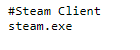

# Parent Steam Service

## Overview

The `Parent Steam Service` is a system service for Windows to manage Steam playtime for parents by controlling the system hosts file. By periodically blocking domains, parents can limit access to Steam, as needed.

The service checks a URL for hosts changes on an interval. When a change is detected, the HOSTS file is modified.

Browsers typically need to be restarted after changing the HOSTS file, in order to take effect.

`manage.php`


`hosts.php`


`reboot.php`


`end.php`



## Setup

To install, open a Visual Studio Command Prompt.

```
installutil bin\Debug\SteamServiceMonitor.exe
```

To uninstall, open a Visual Studio Command Prompt.

```
installutil /u bin\Debug\SteamServiceMonitor.exe
```

After the service has been installed, start the service by either rebooting or hitting play in the `Services` control panel.


When the service is running, the task manager will show a process `SteamServiceMonitor.exe`.


The service can automatically stop named processes.


## Configuration

The `HostsUri` configuration setting monitors the contents of a URL which controls the contents of the system `HOSTS` file.

The `RebootUri` configuration setting monitors the contents a URL which can reboot the machine.

Sample `App.config`:

```
<?xml version="1.0" encoding="utf-8" ?>
<configuration>
    <startup>
        <supportedRuntime version="v4.0" sku=".NETFramework,Version=v4.8" />
    </startup>
  <appSettings>
    <add key="HostsUri" value="https://[your_domain_here]/path/to/hosts.php" />
    <add key="EndUri" value="https://[your_domain_here]/path/to/end.php" />
    <add key="RebootUri" value="https://[your_domain_here]/path/to/reboot.php" />
  </appSettings>
</configuration>
```

### Sample PHP JavaScript

The following sample `PHP` allows the user to control hosts configurations per machine using the `?computer=` query parameter to select the contents that the service uses.

[hosts.php](PHP/hosts.php)

The following sample `PHP` can cause the service to reboot the computer when `yes` is returned. After returning `yes` the file reverts to `no`.

[reboot.php](PHP/reboot.php)

The following sample `PHP` can cause the service to stop the list of processes on the computer when `yes` is returned. After returning `yes` the file reverts to `no`.

[end.php](PHP/end.php)

The following sample `PHP` provides remote actions for `reboot`, `lock`, `unlock` for detected computers. When locked, all steam domains in the `hosts` file will point to localhost and will not resolve correctly. When unlocked, all domain redirects will be commented out in the `hosts` file.

[manage.php](PHP/manage.php)
