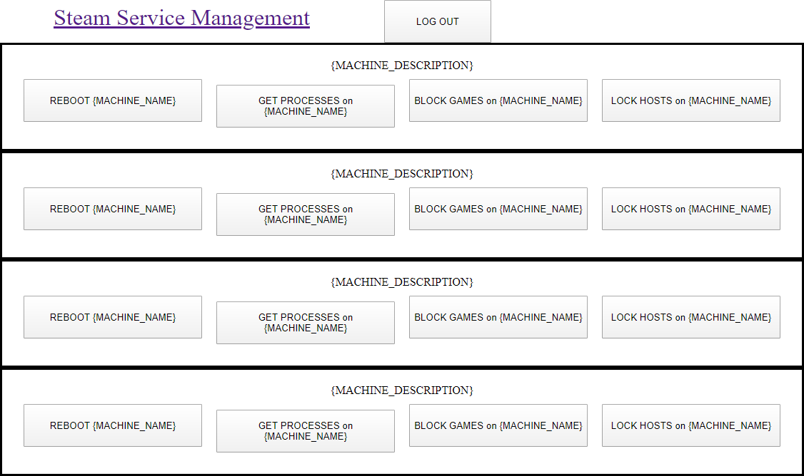
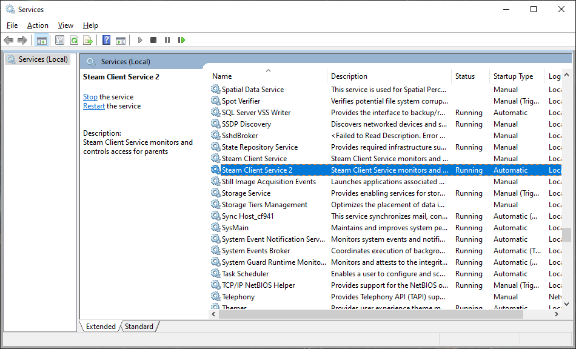
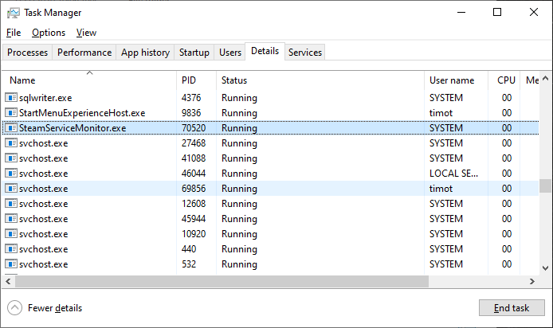
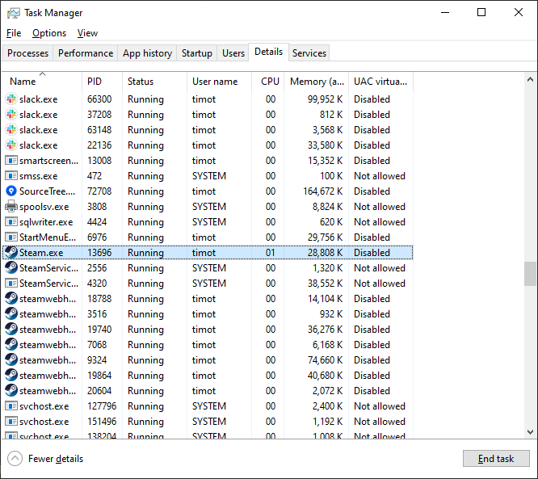

# Parent Steam Service

## Overview

The `Parent Steam Service` is a system service for Windows to manage Steam playtime for parents by controlling the system hosts file. By periodically blocking domains, parents can limit access to Steam, as needed.

The service checks a URL for hosts changes on an interval. When a change is detected, the HOSTS file is modified.

Browsers typically need to be restarted after changing the HOSTS file, in order to take effect.

### Management Web Console

`manage.php`

The web console shows all the machines connected to the service and has a simple user interface to perform actions on the monitored computers. The web console has a protected login and then each operation has a confirm prompt to make sure actions are intentional.



## Setup

To install, open a Visual Studio Command Prompt.

```
installutil bin\Debug\SteamServiceMonitor.exe
```

To uninstall, open a Visual Studio Command Prompt.

```
installutil /u bin\Debug\SteamServiceMonitor.exe
```

After the service has been installed, start the service by either rebooting or hitting play in the `Services` control panel.



When the service is running, the task manager will show a process `SteamServiceMonitor.exe`.



The service can automatically block named processes.



## Configuration

The `HostsUri` configuration setting monitors the contents of a URL which controls the contents of the system `HOSTS` file.

The `GetUri` configuration setting monitors for a request to query processes on the machine.

The `PostUri` configuration setting is the destination from the query for processes on the machine.

The `EndUri` configuration setting monitors the contents a URL which can end processes on the machine.

The `RebootUri` configuration setting monitors the contents a URL which can reboot the machine.

* Sample [App.config](App.config)

### Sample PHP JavaScript

#### Hosts

The following sample `PHP` allows the user to control hosts configurations per machine using the `?computer=` query parameter to select the contents that the service uses.

[hosts.php](PHP/hosts.php)

#### Reboot

The following sample `PHP` can cause the service to reboot the computer when `yes` is returned. After returning `yes` the file reverts to `no`.

[reboot.php](PHP/reboot.php)

#### Get

The following sample `PHP` can cause the service to query for processes running on the computer when `yes` is returned. After returning `yes` the file reverts to `no`.

[get.php](PHP/get.php)

### Post

The following sample `PHP` saves the data that was queried in the `get` operation.

[post.php](PHP/post.php)

#### End

The following sample `PHP` can cause the service to stop the list of processes on the computer when content is returned. The content has a list of process names (one per line). Any lines prefixed with `#` are commented out. The list is returned when games are blocked. The list is block when games are unblocked.

[end.php](PHP/end.php)

#### Manage

The following sample `PHP` provides remote actions for `reboot`, `lock`, `unlock`, and `end` for detected computers. When locked, all steam domains in the `hosts` file will point to localhost and will not resolve correctly. When unlocked, all domain redirects will be commented out in the `hosts` file.

[manage.php](PHP/manage.php)
